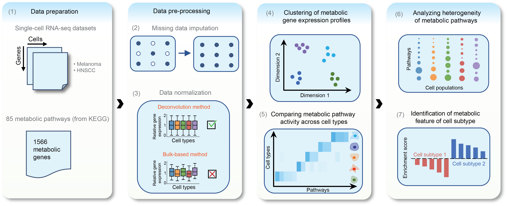

Metabolic landscape of single cells in tumor microenvironment
==========
Introduction
------------
This pipeline is responsible for analyzing metabolic gene expression profile using single-cell RNA sequencing data. 



There are 7 main steps involved in data processing and analysis which organized in 7 different folders.

Requirements
------------
The required R packages can be installed using below command:

``` bash
Rscript install_requiredPackages.R 
```
Download and read the datasets
-----------------------------
``` bash
cd "1-ReadData"
./download_dataset.sh
Rscript readData_head_neck.R
Rscript readData_melanoma.R
cd ../
```
The gene expression data and the annotation of cell type would be stored as the R objects.

Imputation of the missig values
-------------------------------
``` bash
cd "2-Imputation"
Rscript impute_tpm.R melanoma 
Rscript geneNum_statistic.R melanoma
Rscript impute_tpm.R head_neck
Rscript geneNum_statistic.R head_neck
cd ../
```
This step uses the ["scImpute"](https://github.com/Vivianstats/scImpute) package to impute the missing values in gene expression profile. The gene number before and after imputation will also be plotted as the boxplot.

Normalization and evaluation of different normalization methods 
---------------------------------------------------------------
``` bash
cd "3-Normalization"
Rscript normalization.R melanoma
Rscript normalization.R head_neck
cd ../
```
The normalization of gene expression in different cell types will be done by four different methods. The distribution of relative gene expression for each cell type will be generated for evaluation and selection of best normalization method.

Landscape of the metabolic gene expression profile
--------------------------------------------------
``` bash
cd "4-Clustering"
Rscript metabolic_landscape.R melanoma
Rscript metabolic_landscape.R head_neck
Rscript inter_tumor_distance.R melanoma
Rscript inter_tumor_distance.R head_neck
cd ../
```
The t-SNE algorithm will be performed in this step for visualizing metabolic gene expression in millions of cells. The spearman correlation matrix will aslo be generated to show the inter-tumor heterogeneity using metabolic genes.

Metabolic pathway activity
--------------------------
``` bash
cd 5-PathwayActivity
Rscript scRNA_pathway_activity.R melanoma
Rscript scRNA_pathway_activity.R head_neck
Rscript TCGA_pathway_activity.R
cd ..
```
This step will generate the metabolic pathway activity for each cell type using the single-cell RNA sequencing data and bulk-RNA sequencing data. The distribution of the pathway activities in each cell type will be shown as violin plots. The correlation of pathway activities at single-cell resolution and bulk-cell resolution will be shown in scatter plot.

*The bulk RNA-seq data was downloaded from TCGA website, please see the instruction for data downloading and preprocessing in Data/TCGA/README.md* 

Metabolic pathway heterogeneity
-------------------------------
``` bash
cd 6-PathwayHeterogeneity
Rscript intra_malignant_variance_PCA.R melanoma
Rscript intra_malignant_variance_PCA.R head_neck
Rscript intra_non-malignant_variance_PCA.R melanoma
Rscript intra_non-malignant_variance_PCA.R head_neck
cd ..
```
In this step, the PCA and GSEA analysis will be performed to investigate the pathway heterogeneity across cells in each tumor or cell type. 

Metabolic features of cell subtypes
-----------------------------------
``` bash
cd 7-MetabolicPhenotype
Rscript non-malignant_subtype.R melanoma
Rscript non-malignant_subtype.R head_neck
cd ..
```
The metabolic gene expression will be compared across T-cell subtypes and fibroblast subtypes using the GSEA analysis. 

Contact
-------
zhengtao.xiao@duke.edu